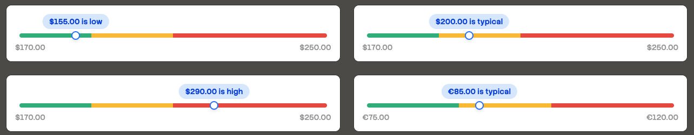

# channel3-ui

A collection of shadcn-style React components for financial data visualization. Copy and paste into your project — you own the code.

## Installation

These components are designed to work with [shadcn/ui](https://ui.shadcn.com). Make sure you have shadcn set up in your project first.

### Prerequisites

- React 18+
- Tailwind CSS
- shadcn/ui configured with the `cn` utility in `lib/utils`

## Components

| Component | Description | Dependencies |
|-----------|-------------|--------------|
| [PriceHistoryChart](./components/price-history-chart) | Area chart for displaying price history over time | `recharts`, shadcn `chart` |
| [PriceRangeGauge](./components/price-range-gauge) | Gauge showing current price within a min/max range | None |

## Usage

1. Browse the component you need
2. Install any listed dependencies
3. Copy the `.tsx` file into your project's components folder
4. Import and use

## Customization

Since you own the code, feel free to modify colors, styling, and behavior to match your design system. The components use Tailwind CSS classes and CSS variables for theming.

## License

MIT
