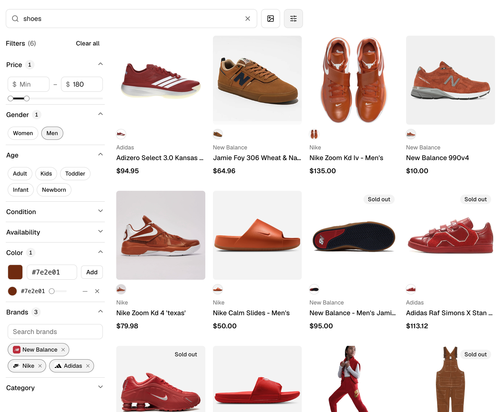
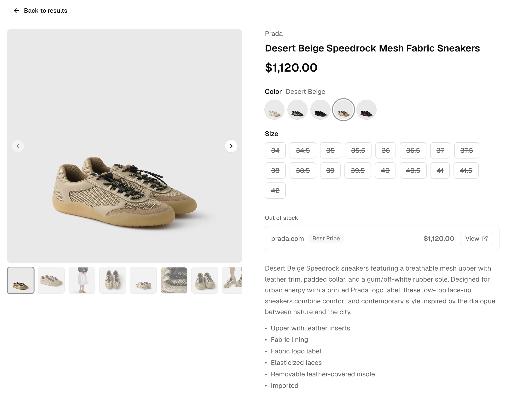
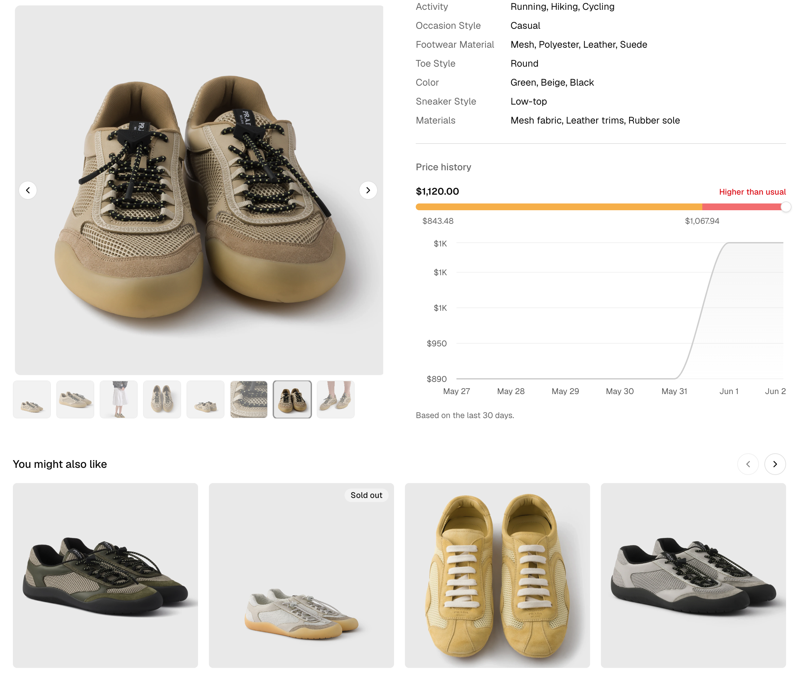

# Channel3 UI

Open-source (MIT) React components for building shopping experiences on the
[Channel3 API](https://docs.trychannel3.com), distributed as a
[shadcn registry](https://ui.shadcn.com/docs/registry). You install the source
with the shadcn CLI and own it like any other component in your project.

Every component is typed directly against
[`@channel3/sdk`](https://www.npmjs.com/package/@channel3/sdk), so a
`ProductDetail` from a search or a product fetch drops straight in — no adapters,
no mapping layer.



## Two blocks, batteries included

Most catalog integrations come down to two screens, and each ships as a compound
**block** that wires the smaller components and hooks together. Drop one in, pass
your server fetchers, and you have a working surface.

**`product-search`** — search bar, faceted filters (price, gender, age, condition,
availability, color, brand, category, and per-category attributes), and an
infinite-scroll results grid. _(Shown above.)_

**`product-details`** — a full PDP: image gallery, variant selection with
server-side re-resolution, merchant offer comparison, price-range gauge and
history chart, extracted attributes, and a lazy "you might also like" carousel.

<table>
<tr>
<td width="50%"></td>
<td width="50%"></td>
</tr>
</table>

Every piece is also available à la carte — compose the individual components and
hooks into your own layout (see the [catalog](#catalog)).

## Install

You need a React project with **shadcn/ui** and **Tailwind CSS v4**. If you're
starting fresh, run `npx shadcn@latest init` first.

Add the full kit in one command — no config needed:

```bash
npx shadcn@latest add https://ui.trychannel3.com/r/all.json
```

Need just one piece? Swap `all` for any item from the [catalog](#catalog) (e.g.
`product-search`, `product-details`, `product-card`):

```bash
npx shadcn@latest add https://ui.trychannel3.com/r/product-search.json
```

The CLI resolves the full dependency tree for you — shared libs, the shadcn
primitives each item builds on, and npm packages (`@channel3/sdk`, `lucide-react`,
`recharts`, …) — and rewrites imports to match your project's aliases.

<details>
<summary>Prefer a shorthand? Register the <code>@channel3</code> namespace</summary>

Add it once to your `components.json`, then install by name
(`npx shadcn@latest add @channel3/all`):

```json
{
  "registries": {
    "@channel3": "https://ui.trychannel3.com/r/{name}.json"
  }
}
```

Installs vendor the source into your repo (and your own git history), so what you
ship is pinned on your side regardless of registry changes — re-running `add` only
updates a component when you ask it to.

</details>

<details>
<summary><b>Vite users:</b> a path-alias gotcha to avoid</summary>

Run `init` _before_ adding components, and make sure your path alias lives in the
**root `tsconfig.json`** (`"baseUrl": "."`, `"paths": { "@/*": ["./src/*"] }`).
The `react-ts` template puts `paths` in `tsconfig.app.json`, which the shadcn CLI
doesn't read — without it, the CLI writes files into a literal `@/` folder instead
of `src/`.

</details>

## Quick start

```tsx
import type { ProductDetail } from "@channel3/sdk/resources";
import { ProductGrid } from "@/components/product-grid";

export function Results({ products }: { products: ProductDetail[] }) {
  return <ProductGrid products={products} onSelect={(p) => navigate(`/p/${p.id}`)} />;
}
```

## Architecture: presentational components, server-side data

These components are **presentational**. They take Channel3 data as props and emit
user intent through callbacks — they never call the Channel3 API and never touch
your API key.

This matters because your Channel3 API key is a server secret: the `x-api-key`
header must only be sent from a trusted server. So you fetch and shape data there,
then hand the results to these components:

```ts
// server-only — runs where CHANNEL3_API_KEY lives, never in the browser
import Channel3 from "@channel3/sdk";

const client = new Channel3({ apiKey: process.env.CHANNEL3_API_KEY! });

export async function searchProducts(query: string) {
  const page = await client.products.search({ query });
  return page.products; // ProductDetail[] — hand straight to <ProductGrid>
}
```

A lint rule in this repo blocks runtime imports of `@channel3/sdk` in component
source to keep that boundary intact — only `import type` is allowed.

> **Wiring it into your framework.** Connecting these server fetchers to Next.js
> Route Handlers, TanStack Start server functions, or React Router actions — plus
> variant re-resolution and recommendations — is covered by the
> [Channel3 API skill](https://github.com/channel3-ai/skills) (`channel3-api`),
> which teaches AI coding agents the API, this component library, and the variant
> model. Install it with `npx skills add channel3-ai/skills --skill channel3-api`.

## Updating

Because the source is vendored into your repo, updating is just re-running `add`
with `--overwrite` for the items that changed. The CLI re-fetches the latest
source and pulls in any new dependencies (e.g. a component that started using a new
primitive):

```bash
# refresh everything
npx shadcn@latest add https://ui.trychannel3.com/r/all.json --overwrite
```

Two things to know:

- **`--overwrite` replaces your local copy.** If you've customized a component,
  run this on a clean working tree and review the `git diff` to reconcile your edits.
- **Removed dependencies become orphans, not deletions.** The CLI only adds and
  updates files; if an item stops using a primitive, the old file stays behind and
  is yours to delete.

## Local development

```bash
pnpm install
pnpm dev              # component playground (every component, every state)
pnpm registry:build   # build the registry into public/r
pnpm check            # typecheck + lint + test
```

Component source lives in `registry/default/`. The vendored shadcn primitives in
`components/ui/` exist only for the playground and type-checking; they aren't
redistributed — items reference them as registry dependencies so the CLI installs
the consumer's own copy.

## Catalog

| Item | Type | Description |
| --- | --- | --- |
| `product-search` | block | Search bar + filters + infinite-scroll grid, wired to `useProductSearch` |
| `product-details` | block | Compound PDP composing the gallery, variants, offers, price, attributes, and recommendations |
| `product-card` | component | Image-forward tile with hover image-swap, colorway swatches, and a skeleton |
| `product-grid` | component | Responsive grid with skeletons and an empty state |
| `product-carousel` | component | Horizontally scrollable row of equal-height cards |
| `image-gallery` | component | Image carousel with a synced thumbnail strip and swatch previews |
| `variant-selector` | component | Pills/swatches with purchasable, out-of-stock, and not-offered tiers |
| `offers-list` | component | Merchant comparison, in-stock first, with buy links |
| `product-attributes` | component | Extracted attributes as a definition list |
| `price-range-gauge` | component | Current price against its historical low/typical/high range |
| `price-history-chart` | component | Area chart of price over time |
| `product-recommendations` | component | Lazy "you might also like" carousel that fetches when scrolled into view |
| `search-bar` | component | Controlled search input with clear and optional image search |
| `product-filters` | component | Configurable filter panel — stacked sidebar or horizontal popover bar |
| `use-product-search` | hook | Query/filter state, debounced search, infinite-scroll pagination |
| `use-infinite-scroll` | hook | Headless token-paginated infinite scroll for any list, with a sentinel ref |
| `use-variant-selection` | hook | Selection state + server-side re-resolution |
| `use-product-recommendations` | hook | Lazy similar-products fetch via an injected fetcher |
| `use-async-options` | hook | Debounced typeahead loader for brand/category suggestions |
| `format` / `variants` / `search` | lib | Pure helpers — formatting, variant tiers, filter mapping |
