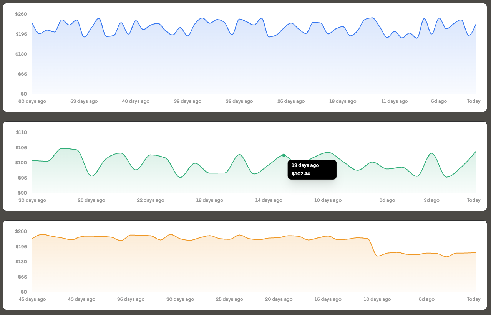

# PriceHistoryChart

An area chart for displaying price history over time with customizable colors, tooltips, and axis options.



## Installation

```bash
# Install required shadcn component
npx shadcn@latest add chart

# Install recharts
npm install recharts
```

Then copy `price-history-chart.tsx` to your components folder.

## Usage

```tsx
import { PriceHistoryChart } from "@/components/price-history-chart";

const data = [
  { timestamp: "2024-01-01", price: 100 },
  { timestamp: "2024-01-02", price: 105 },
  { timestamp: "2024-01-03", price: 102 },
];

<PriceHistoryChart 
  data={data}
  currency="USD"
  yAxisDomain="auto"
/>
```

## Props

| Prop | Type | Default | Description |
|------|------|---------|-------------|
| `data` | `PriceHistoryDataPoint[]` | required | Array of `{ timestamp, price }` objects |
| `currency` | `string` | `"USD"` | Currency code for formatting |
| `formatPrice` | `(value: number, currency: string) => string` | - | Custom price formatter |
| `formatDate` | `(date: Date) => string` | - | Custom date formatter for tooltips |
| `showYAxis` | `boolean` | `true` | Show/hide Y axis |
| `showXAxis` | `boolean` | `true` | Show/hide X axis |
| `color` | `string` | `"#3b82f6"` | Line and fill color |
| `yAxisDomain` | `"auto" \| [number, number]` | - | Y-axis range. `"auto"` fits to data, or specify `[min, max]` |
| `className` | `string` | - | Additional CSS classes |

## Examples

### Auto-scaling Y-axis

```tsx
<PriceHistoryChart 
  data={data}
  yAxisDomain="auto"
/>
```

### Custom color

```tsx
<PriceHistoryChart 
  data={data}
  color="#10b981" // green
/>
```

### Hidden axes (sparkline style)

```tsx
<PriceHistoryChart 
  data={data}
  showXAxis={false}
  showYAxis={false}
  className="h-16"
/>
```

### Custom formatters

```tsx
<PriceHistoryChart 
  data={data}
  currency="EUR"
  formatPrice={(value, currency) => 
    new Intl.NumberFormat("de-DE", { style: "currency", currency }).format(value)
  }
  formatDate={(date) => date.toLocaleDateString("de-DE")}
/>
```

## Types

```tsx
type PriceHistoryDataPoint = {
  timestamp: Date | string;
  price: number;
};
```

